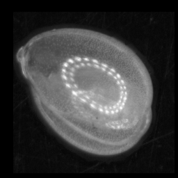

.. Particle Classification documentation master file, created by
   sphinx-quickstart on Sat Aug 10 12:32:34 2019.
   You can adapt this file completely to your liking, but it should at least
   contain the root `toctree` directive.

Particle Classification
=======================

Welcome to the help and tutorial documentation for the ParticleTrieur program and particle classification Tensorflow library.

**ParticleTrieur 2.0.19-beta**

`Download ParticleTrieur 2.0.19-beta for Windows <https://1drv.ms/u/s!AiQM7sVIv7fah4Z_otBACwSPnuzlSg?e=3hXxEL>`_

`Download ParticleTrieur-GPU 2.0.19-beta for Windows <https://1drv.ms/u/s!AiQM7sVIv7fah4cAtVdAefCD7NHxZQ?e=8fdzdR>`_. Requires an NVIDIA graphics card and `CUDA Toolkit 10.0 <https://developer.nvidia.com/cuda-10.0-download-archive>`_. 

*Ensure CUDA 10.0 is installed and not CUDA 10.1. Please restart computer after CUDA installation.*

`Download ParticleTrieur 2.0.19-beta for MacOS <https://1drv.ms/u/s!AiQM7sVIv7fah4cBZT1FQASbEbopWw?e=020Aaa>`_

.. Note:: What's new in 2.0.19-beta

   - Fixed a out-of-memory error due to memory leak

**MISO 2.0.7:**

`Github repository for MISO 2.0.7 <https://github.com/microfossil/particle-classification>`_ 

Install using ``pip install -U git+https://github.com/microfossil/particle-classification``

.. Note:: What's new in 2.0.7

   - Cyclic / cyclic gain networks for transfer learning.

This software was developed by Ross Marchant, initially as part of project led by Thibault de Garidel-Thoron, and with input from Martin Tetard. Thibault and Martin contributed significantly to the direction and testing of the of the software.

Overview
--------
Automated classification of images can improve efficiency in the laboratory, particularly for tedious manual tasks such as counting particle types (e.g. foraminifera morphotypes) from microscope slides.

.. image:: images/particles/U_peregrina.png
   :width: 100px

.. image:: images/particles/B_pagoda.png
   :width: 100px

.. image:: images/particles/B_spissa.png
   :width: 100px

.. image:: images/particles/Planktic.png
   :width: 100px

We have created two pieces of software to enable researchers to create and use their own automatic classification system based on convolutional neural networks (CNNs):

- **MISO** is a library of python scripts that simplify training a CNN from a set of labeled images. A variety of common CNN topologies can be chosen, such as variations of ResNet or using transfer learning, as well as or own CNN topology using cyclic layers. The system is optimised for particle images. 

- **ParticleTrieur** is a cross-platform java program to help organise, label, process and classify images, particularly for particle samples such as microfossils. It can be used for both the creation of the training set required to make a CNN classifier, and classification of image using a trained CNN. It also includes some image processing functions, morphology calculations and statistical graph generation.

.. image:: images/software/particle-trieur.png
   :width: 600px

A computer with a high-powered graphics card is not necessary for training the CNNs, we will use **google colab** to perform training in the cloud.

:doc:`Click here to get started! <tutorial/getting_started>`

.. toctree::
   :maxdepth: 1
   :caption: Tutorial:

   tutorial/getting_started
   tutorial/dataset_creation
   tutorial/training
   tutorial/training_2
   tutorial/inference

.. toctree::
   :maxdepth: 1
   :caption: ParticleTrieur:

   particle_trieur/overview
   particle_trieur/quick_start

.. Indices and tables
.. ==================

.. * :ref:`genindex`
.. * :ref:`modindex`
.. * :ref:`search`
