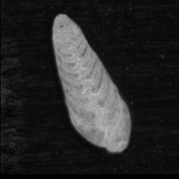

.. Particle Classification documentation master file, created by
   sphinx-quickstart on Sat Aug 10 12:32:34 2019.
   You can adapt this file completely to your liking, but it should at least
   contain the root `toctree` directive.

.. important:: 

   Please note that this is pre-release software and there may be bugs. Please email me at ross.g.marchant(at)gmail.com with any issues or suggestions for improvement.
   

Particle Classification
=======================

Welcome to the help and tutorial documentation for the ParticleTrieur program and the MISO CNN training Tensorflow library.

**ParticleTrieur 2.2.0**

There are some big changes to the way we deliver updates currently in progress!

New releases have been moved to the github repository at <https://github.com/microfossil/particle-trieur/`>

`Download ParticleTrieur 2.2.0 for all platforms <https://github.com/microfossil/particle-trieur/releases>`_

Currently we provide installers for macOS and Windows. 

Linux users please run directly from the .jar file using "java -jar ParticleTrieur.jar" from the same directory as the jar file. Java 8 is required when running from the jar file. If you do not have java 8 installed, please install Amaxon Coretto 8 or similar.

**MISO**

MISO is the python library that ParticleTrieur calls to do convolutional neural network (CNN) training.

It is open-source and available on github. MISO can also be installed using ParticleTrieur. Please follow the instructions for installing Anaconda and Tensorflow first

Paper
-----

A paper has been published on training a CNN with MISO at the `Journal of Micropalaeontology <https://jm.copernicus.org/articles/39/183/2020/>`_

Please reference as:

@article{jm-39-183-2020,
   author = {Marchant, R and Tetard, M and Pratiwi, A and Adebayo, M and de Garidel-Thoron, T},
   doi = {10.5194/jm-39-183-2020},
   journal = {Journal of Micropalaeontology},
   number = {2},
   pages = {183--202},
   title = {{Automated analysis of foraminifera fossil records by image classification using a convolutional neural network}},
   url = {https://jm.copernicus.org/articles/39/183/2020/},
   volume = {39},
   year = {2020}
}

Overview
--------
Automated classification of images can improve efficiency in the laboratory, particularly for tedious manual tasks such as counting particle types (e.g. foraminifera morphotypes) from microscope slides.

.. image:: images/particles/U_peregrina.png
   :width: 100px

.. image:: images/particles/B_pagoda.png
   :width: 100px

.. image:: images/particles/G_affinis.png
   :width: 100px

.. image:: images/particles/Planktic.png
   :width: 100px

We have created two pieces of software to enable researchers to create and use their own automatic classification system based on convolutional neural networks (CNNs):

- **MISO** is a library of python scripts that simplify training a CNN from a set of labeled images. A variety of common CNN topologies can be chosen, such as variations of ResNet or using transfer learning, as well as or own CNN topology using cyclic layers. The system is optimised for particle images. 

- **ParticleTrieur** is a cross-platform java program to help organise, label, process and classify images, particularly for particle samples such as microfossils. It can be used for both the creation of the training set required to make a CNN classifier, and classification of image using a trained CNN. It also includes some image processing functions, morphology calculations and statistical graph generation.

A computer with a high-powered graphics card is not necessary for training the CNNs, we will use **google colab** to perform training in the cloud.

:doc:`Click here to get started! <tutorial/getting_started>`

.. toctree::
   :maxdepth: 1
   :caption: Tutorial:

   tutorial/getting_started
   tutorial/dataset_creation
   tutorial/training
   tutorial/training_2
   tutorial/inference

.. toctree::
   :maxdepth: 1
   :caption: ParticleTrieur:

   particle_trieur/overview
   particle_trieur/quick_start

.. Indices and tables
.. ==================

.. * :ref:`genindex`
.. * :ref:`modindex`
.. * :ref:`search`
