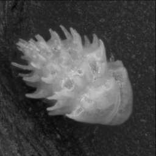
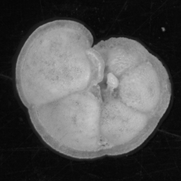

.. Particle Classification documentation master file, created by
   sphinx-quickstart on Sat Aug 10 12:32:34 2019.
   You can adapt this file completely to your liking, but it should at least
   contain the root `toctree` directive.

Particle Classification
===================================================

Welcome to the help and tutorial documentation for the ForamTrier program and particle classification Tensorflow library created by Ross Marchant.

Overview
--------
Automated classification of images can improve efficiency in the laboratory, particularly for tedious manual tasks such as counting particle types (e.g. foraminifera morphotypes) from microscope slides.

.. image:: images/particles/U_peregrina.png
   :width: 100px

.. image:: images/particles/B_spissa.png
   :width: 100px

.. image:: images/particles/G_affinis.png
   :width: 100px

We have created two pieces of software to enable researchers to create and use their own automatic classification system based on convolutional neural networks (CNNs):

- **MISO** is a library of python scripts that simplify training a CNN from a set of labeled images. A variety of common CNN topologies can be chosen, such as variations of ResNet or using transfer learning, as well as or own CNN topology using cyclic layers. The system is optimised for particle images. 

- **ParticleTrieur** is a cross-platform java program to help organise, label, process and classify images, particularly for particle samples such as microfossils. It can be used for both the creation of the training set required to make a CNN classifier, and classification of image using a trained CNN. It also includes some image processing functions, morphology calculations and statistical graph generation.

.. image:: images/software/particle-trieur.png
   :width: 600px

A computer with a high-powered graphics card is not necessary for training the CNNs, we will use **google colab** to perform training in the cloud.

:doc:`Click here to get started! <tutorial/getting_started>`

.. toctree::
   :maxdepth: 2
   :caption: Tutorial:

   tutorial/getting_started
   tutorial/dataset_creation
   tutorial/training
   tutorial/training_2
   tutorial/inference

.. Indices and tables
.. ==================

.. * :ref:`genindex`
.. * :ref:`modindex`
.. * :ref:`search`
