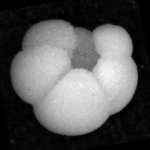
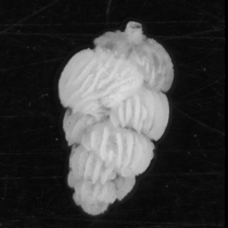

Introduction
============

Overview
--------

ParticleTrieur (PT) is a java program for organising and labelling images, particularly particle images such as microfossils or other organisms, but can be used for any image-level labelling task.

MISO is a python library for easy training of convolutional neural networks (CNNs). Convolutional neural network (CNN) based classification systems are currently the state-of-the-art in image classification, outperforming previous methods based on engineered features. ParticleTrieur contains a graphical user interface (GUI) for launching CNN training with the MISO library. The trained CNN model can then be imported into PT to classify new images.

The procedure to create a CNN using PT and MISO is:

#. **Creation:** Create an dataset consisting of a wide variety of images of all the different classes you wish to identify. The images should span the range of normal variations you would expect to see in each class.

#. **Labeling:** Label the images according to their class using PT. PT can suggest labels based on the images you have already labelled.

#. **Training:** Train a CNN using the labeled images. MISO comes with a range of CNN models to try.

#. **Validation:** The training scripts produce graphs of the accuracy of the network, as well as estimating if any images have been mislabeled. We use these results to tweak the CNN parameters or double-check the image labeling, respectively.

#. **Inference:** The final output of training is a *frozen* CNN model which can now be used for classifying unknown images. The model is loaded into PT to help train unseen images.

#. **Export:** The labeled or classified images information can be exported as a CSV for further analysis. 

PT and MISO have many other features outside of this workflow, such as calculating particle morphology, running as server, exporting abundance counts, an so on.

.. important::

   The CNN models trained with the MISO library take a fixed-size square image that has been normalised to the range 0-1 (e.g. by dividing by 255) as input.

CNN primer
----------

Convolutional neural networks (CNNs) are are very good pattern recognisers. During training they *learn* which image features correspond to which classes. Then once trained, they classify images according to which features are found in the image.

This leads to a few important observations:

**1. We cannot expect the CNN to accurately classify an image whose distinguishing features are NOT in the training set.**

For example, the following images show the dorsal (left) and umbilical (right) views of a *N. dutertrei* foraminifera microfossil particle. If only the dorsal view is in the training set, the CNN may have difficultly classifying images of the umbilical view, as the image contains a different set of features.

.. image:: images/particles/dut_dorsl.png
   :width: 100px

**2. Images not in the training set may be classified with high probability into one of the classes in the training set.**

The CNN tries to classify an image into one of the learnt classes, according to the features in the image. If an image is from a class that **not** is not one of the learnt classes (i.e. an 'invader') it may still be classified with high "probability" as one of the learnt classes.

For example, say we had a CNN trained on the following four classes:

.. image:: images/particles/B_pagoda.png
   :width: 100px

.. image:: images/particles/B_spissa.png
   :width: 100px

.. image:: images/particles/Planktic.png
   :width: 100px

and used it to classify this image:

.. image:: images/particles/G_affinis.png
   :width: 100px

The image might be classified with high probability as belonging into the last class, due to having the same round shape. This is because the output of CNNs (trained as multi-class classifiers using softmax) are a vector, consisting of one probability value for each class, that all add up to 1. These "probabilities" are not probabilities in the sense of likelyhood of belonging to a distribution, as with some traditional classifiers. Thus we cannot use the network to flag images *not* in the training set.

**3. The CNN will learn features that differentiate each class, even if they do not belong to the object.**

The CNN sees the images as patterns of pixels, not as a 2D representation of an arrangement of objects. This mean it will learn any patterns that differentiate classes, regardless if they belong to the object of interest or not.

For example, of these five classes, only the last has the reflection of the ring light, due to its shiny surface. The CNN may learn that the presence of a ring light reflection means the image is from class 5. Therefore the CNN may have trouble recognising images of the same particle taken with a different lighting system where this pattern is not present.

.. image:: images/particles/B_pagoda.png
   :width: 100px

.. image:: images/particles/B_spissa.png
   :width: 100px

.. image:: images/particles/Planktic.png
   :width: 100px

.. image:: images/particles/G_affinis.png
   :width: 100px

Other things such as changes in background can also significantly affect classification performance if they are not in the training set.

The images used for training should cover all the variations in the class that you need to be able to predict. These variations could include:

- Intra-class variations, e.g. morphology, damage, preservation
- Position variations, e.g. pose (lying on top / side etc), rotation, location in image, size in image
- Acquisition system variations, e.g. brightness, contrast, colour, focus

Acquiring images covering all of the permutations of these variations would be difficult and time-consuming. Fortunately, we can use other techniques to reduce this load. 

- Pre-processing can be used to remove variations, such as the size and location of the particle in the image. It is performed before training.
- Augmentation is used to simulate variations in the brightness, contrast, rotation, zoom and offset of the particle in the image. It is performed duing training.

.. important::

   The ParticleTrieur and MISO libraries perform the following pre-processing steps:

   1. Rescale the image to the range 0-1 by dividing by 255 (e.g. for normal 8-bit images)
   2. Resize and pad the image to the square shape required by the CNN. The padding value is the median of the pixels along the border of the image.

   And the following augmentations are used by default:

   - rotation
   - brightness
   - contrast
   - zoom

Image acquisition
-----------------

As a general guide, images of particle should be acquired:

- Using the same brightness, contrast, zoom and white balance
- With the particle centred in the image with a small buffer around them
- Without the addition of extra image features such as scale bars or captions
- With black or white borders

Enough images of each class should be captured to cover the morphological variations present, such as:

- shape
- damage
- preservation
- pose
- colour

We recommend at minimum of 50 and preferably at least 200 images per class of simple particles such as foraminifera or plankton. In particular, one must pay attention to have enough images of each pose. It may not be possible to obtain 50 images of some rare classes. It is ok to still include these in the selection, as they can be excluded later in the training procedure.