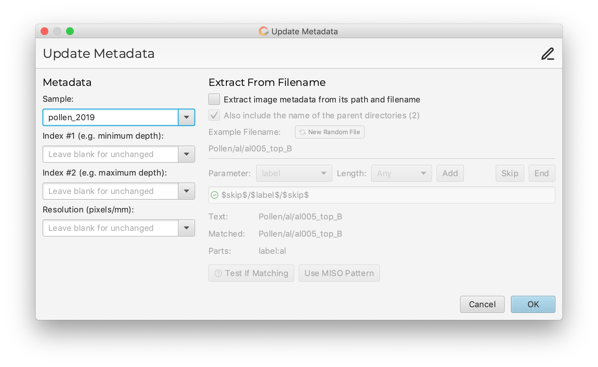
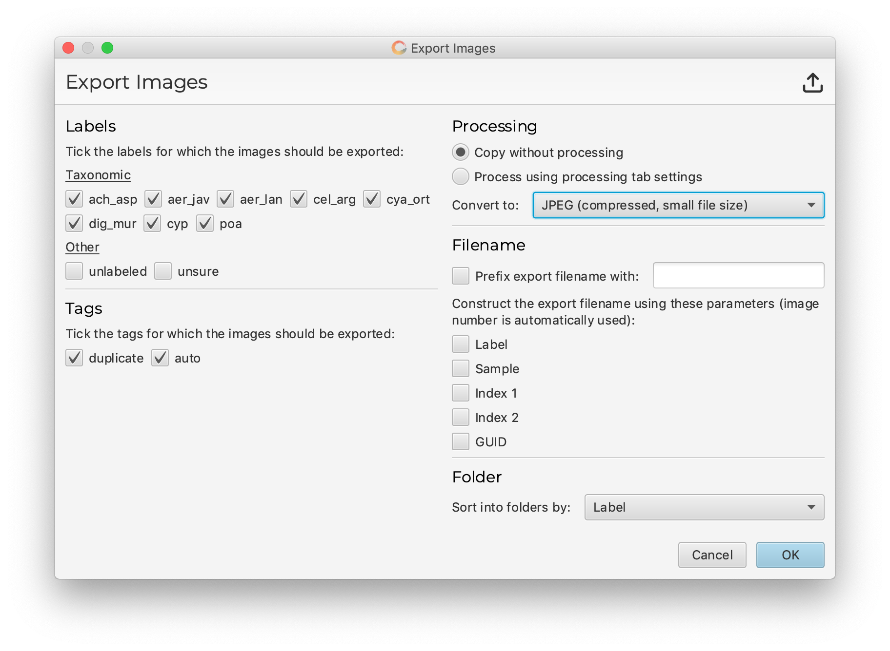
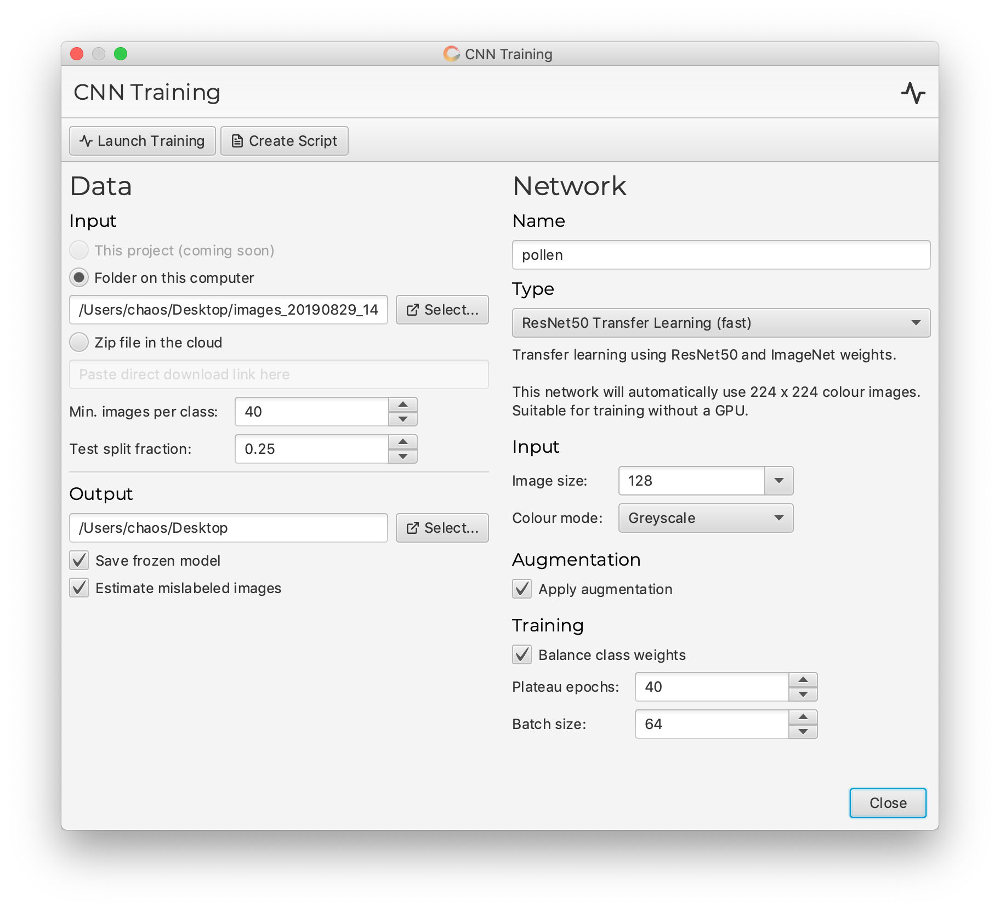
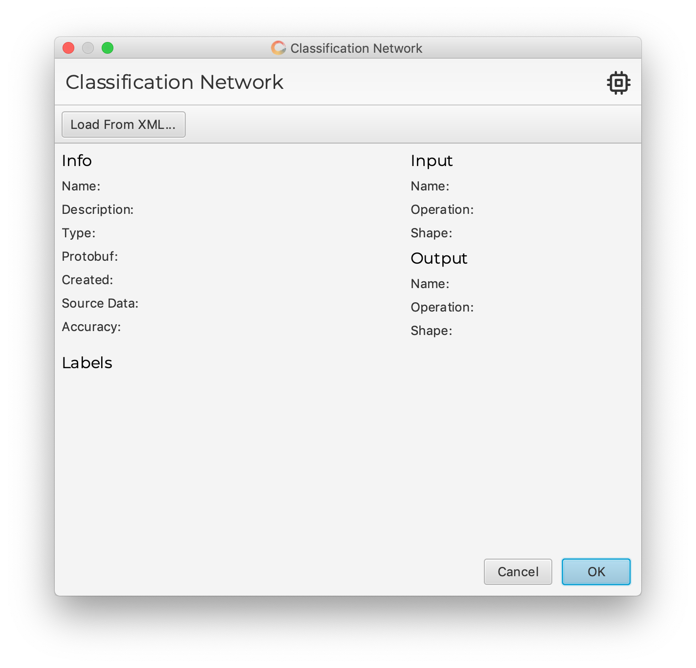
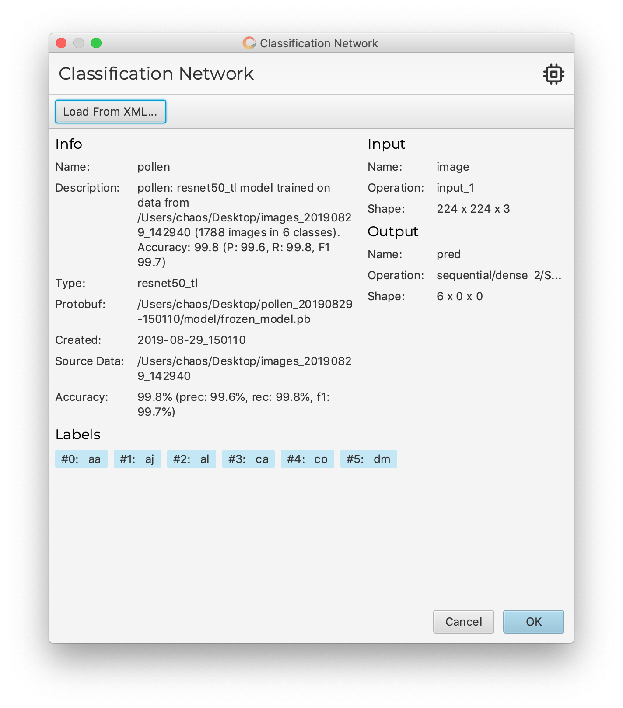

Quick Start
===========

The following tutorial gives a quick start to the typical ParticleTrieur workflow:

* Start a new project and add images.
* Add labels for the classes you wish to classify.
* Export the labeled images.
* Launch training.
* Load the trained network and use it to classify unlabeled images.

Before beginning for the first time, please read the tutorial on :doc:`../tutorial/dataset_creation` to understand what to consider when creating a training dataset.

Start up
--------

1. Launch ParticleTrieur and select *New Project* in the startup window.

.. image:: ../images/software/startup.png
    :width: 400px

2. After a few seconds to load, the main window will show.

* At the top is a toolbar of commonly used commands
* On the left is a table which lists all the added images
* On the right there are three tabs:

    * :guilabel:`Classification` Manual labeling of images and prediction using either the built in AI or and external CNN.
    * :guilabel:`Similarity` The most similar images to the currently selected image.
    * :guilabel:`Processing` Methods for processing the images, e.g. brightness normalisation.

.. image:: ../images/software/startup_main.png

Add images
----------

1. Click :guilabel:`Add` to start adding images. The add dialog will pop up.

.. image:: ../images/software/add_images.png

2. In the dialog that pops up select to add by folder (all images in the folder and sub-folder will be added) or by image (select one or multiple images) then click *Choose...* to select the folder / images.

3. Click :guilabel:`OK` to add the images, then :guilabel:`Close` on the progress dialog once it is finished.

4. The Edit Metadata dialog will pop up:

5. Enter any metadata associated with the images (leave blank if unknown):

* ``Sample`` - The name of the sample from which the images were taken.
* ``Index 1`` - The primary numerical index for which the images can be sorted (e.g. starting core depth for foraminifera).
* ``Index 2`` - The secondary numerical index for which the images can be sorted (e.g. end core depth for foraminifera)
* ``Resolution`` - The resolution of the images in pixels per millimeter.

6. Click :guilabel:`OK` to update the metadata, then :guilabel:`Close` on the progress dialog once it is finished.

Feature vector
--------------

ParticleTrieur automatically calculates a *feature vector* for every image. The feature vector is like a finger print of the image, and similar images have similar vectors. The feature vector is used for k-NN classification and for the similary tab.

The progress of the feature vector calculation is shown in the top right corner of the screen:

.. image:: ../images/software/post_adding.png

Also whenever there is a significant change to the project, the save button will be highlighted in red, to remind you the project needs saving.

Save the project
----------------

1. Save the project by clicking :guilabel:`Save` and choosing a save location.

.. Important:: 

    The location of the added images is saved in the project file as a relative path to the project file, except if they are on an external drive (Windows), in which they are saved as absolute paths.  

    This means that the project file is moved, the images must be moved with it, to keep the same relative structure. **We recommend storing the project file in the parent directory (or same directort) of the images** to make this easier.

The project is saved as a plain-text XML file. You can edit it manually if desired.

Add labels
----------

Add a label for each of the classes you wish to identify:

1. In the classification tab, click the :guilabel:`+ Add` button in the ``Labels`` section. 

2. Enter the code, name and description of the label

* Code: This is the text that will identify the label. It will appear on the label button and be used as the class name for CNN training. We recommend either a short, memorable code or the full name in the format `genus_species` (i.e. no spaces). Whatever, the code, it should be consistant across projects!

* ``Name`` - The name of the class the label refers to, e.g. a full taxonomic classification (optional).

* ``Description`` - Further details of the class (optional).

.. image:: ../images/software/add_label.png
    :width: 400px

3. Click :guilabel:`OK`.

4. Repeat steps 1-3 for the remaining labels. After this is complete, there will be one button for each label in the ``Labels`` section.

.. Note::

    To edit or delete a label, right-click the label button and click :guilabel:`Edit...` or :guilabel:`Delete...` in the pop-up dialog.

Label images
------------

1. Label an image by selecting it from list on the left then clicking the corresponding label button

.. image:: ../images/software/post_add_label.png

.. Tip:: 

    Enable :guilabel:`Auto-advance` to have ParticleTrieur automatically move on to the next image after the label button is clicked.

The in-built *k-NN prediction* system will automatically predict which label belongs to an image using the previously labeled images and their feature vectory.

It does this by looking at the top N (usually 12) most-similar images *that have already been labeled* to the selected image, and assigning a score to each label based on the number of images in that label in the top N.

The scores are shown as red bars across the top of the label buttons. The length of the red bar (compared to the width of the button) indicates the score. The best prediction (the highest score) is indicated by a grid symbol.

.. image:: ../images/software/knn_score.png
    :width: 500px

.. Note::

    The k-NN prediction only considers images that have already been labeled. Therefore, it will not be accurate until enough images from each class have been labeled. 

Export labeled images
---------------------

Once enough images have been labeled to create the training set, the images need to be exported for training.

.. Tip:: Select :guilabel:`Statistics` > :guilabel:`Counts` > :guilabel:`Label` from the menu bar to see the counts for each label.

1. Click :guilabel:`Export` in the toolbar. The export dialog will pop up:

2. Images are often in TIFF format which has a very large file size. Change ``Convert to`` from :guilabel:`No conversion` to :guilabel:`JPEG (compressed, small file size)` to export the images in JPEG format to reduce their size. This is especially useful the images need to be uploaded for cloud training.

3. Click :guilabel:`OK` and select a folder to save the exported images in.

The images will be saved in a root folder called ``images_YYYYMMDD_hhmmss`` where ``YYYYMMDD-hhmmss`` is the current date and time. Inside the images folder will be a sub-folder for each label, containing the corresponding images.

Train network
-------------

Before starting for the first time, please read the section :doc:`../tutorial/training`.

If you wish to train in the cloud using Google Colab, please follow the relevant section in the :doc:`../tutorial/training_2` section.

This section deals with training locally using ParticleTrieur.

1. If the MISO particle classification library is not already installed, follow the setup instructions in the :doc:`../tutorial/training_2` section.

2. Click :guilabel:`Training` in the toolbar. The training configuration dialog will pop up:

3. In the ``Input`` section, click :guilabel:`Select...` and choose the root folder where the images were exported (the ``images_YYYYMMDD_hhmmss`` folder).

4. In the ``Output`` section, click :guilabel:`Select...` and choose a folder to save the training output.

5. In the ``Network`` section, enter a name to identify the trained network

6. If using for the first time, we recommend to leave all the other settings the same, and make sure :guilabel:`ResNet50 Training Learning (fast)` is selected. See the Google Colab tutorial for a more in-depth explanation of the variables.

7. Click :guilabel:`Launch Training` and the training progress view will pop-up:

The training progress view shows the status and graph of training and the console output from the MISO python script. If there is an error, please check the console tab, as this will contain the full python error trace.

8. Wait until training is complete. The *Generating Model* step may take a long time on a computer without a high-powered GPU.

Once complete, the output of the training will be saved into the folder specified earlier. The outputs include:

* Frozen CNN model and metadata XML in the ``model`` directory. These contain the trained network ready for use in classification.
* Graphs of accuracy, precision and recall.
* Estimates of which images have been mislabeled in the ``mislabeled`` folder.

9. Close the training dialogs.

Use network for classification
------------------------------

The trainined network is now ready be used for classification!

1. In the :guilabel:`Classification` tab, under ``Deep CNN``, click :guilabel:`Select...`. The classification network dialog will pop-up:

2. Click :guilabel:`Load from XML...` and select the ``network_info.xml`` file from the ``model`` folder for the network that was just trained.

3. The network information will be shown in the window. Click :guilabel:`OK` to use the network. Any labels that are used by the network will be added to the project.

Once the CNN is activated, click on an image in the list will automatically predict the image label using the network, as is done with the k-NN prediction system. The CNN prediction score appears as a blue bar at the bottom of the label button and the best prediction is indicated by a CPU chip symbol.

.. Tip::

    Use :guilabel:`Tools` > :guilabel:`Predict label using CNN` >  :guilabel:`Unlabeled` to automatically label any unlabeled images in a project.

Conclusion
----------

This section covered the basics of labelling, exporting and training using ParticleTrieur. 

If any bugs are encountered, please contact me at ross(dot)g(dot)marchant(at)gmail(dot)com or raise an issue on the `particle-classification-examples github page <https://github.com/microfossil/particle-classification-examples/issues>`_

