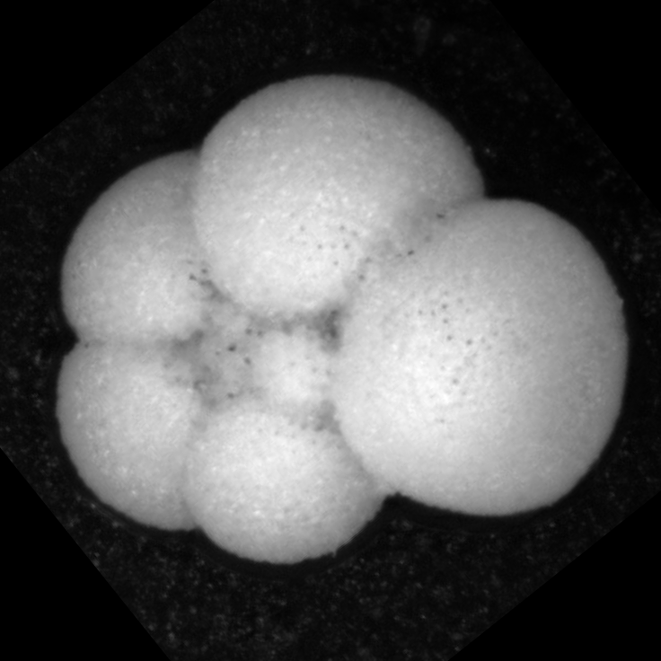
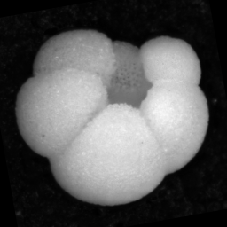
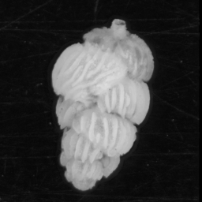
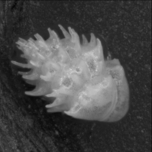
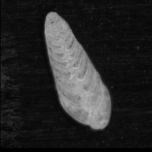
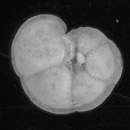
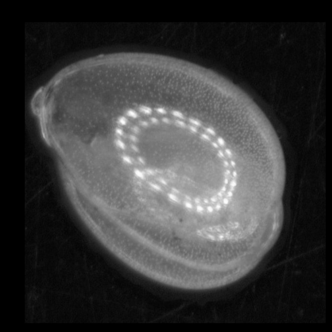

.. _dataset-creation:
Creating a dataset
==================

An important note on convolutional neural networks
--------------------------------------------------

Despite the hype, convolutional neurals networks (CNNs) are not magic. They are very good pattern recognisers, during training they *learn* which image features correspond to which classes. Then once trained, they classify images according to which features are found in the image.

This leads to a few important observations:

.. tip:: One cannot expect the CNN to accurately classify an image whose distinguishing features are *not in the training set*. 

For example, the following images show the dorsal (left) and umbilical (right) views of a *Duterii* foraminifera microfossil particle. If only the dorsal view is in the training set, the CNN may have difficultly classifying images of the umbilical view, as the image contains a different set of features.





.. tip:: Images not in the training set may be classified with high probability into one of the classes in the training set.

The CNN tries to classify an image into one of the learnt classes, according to the features in the image. If an image is from a class that **not** is not one of the learnt classes (i.e. an 'invader') it may still be classified with high "probability" as one of the learnt classes.

For example, say we had a CNN trained on the following four classes:









and used it to classify this image:



The image might be classified with high probability as belonging into the last class, due to having the same round shape. This is because the output of CNNs (trained as multi-class classifiers using softmax) are a vector, consisting of one probability value for each class, that all add up to 1. These "probabilities" are not probabilities in the sense of likelyhood of belonging to a distribution, as with some traditional classifiers. Thus we cannot use the network to flag images *not* in the training set.

.. tip:: The CNN will learn features that differentiate each class, even if they do not belong to the object.

The CNN sees the images as patterns of pixels, not as a 2D representation of an arrangement of objects. This mean it will learn any patterns that differentiate classes, regardless if they belong to the object of interest or not.

For example, of these five classes, only the last has the reflection of the ring light, due to its shiny surface. The CNN may learn that the presence of a ring light reflection means the image is from class 5. Therefore the CNN may have trouble recognising images of the same particle taken with a different lighting system where this pattern is not present.


Other things such as changes in background can also significantly affect classification performance if they are not in the training set.

Variations
----------

The images used for training should cover all the variations in the class that you need to be able to predict. These variations could include:

- Intra-class variations, e.g.:

   - morphology
   - damage
   - preservation

- Position variations, e.g.:

   - pose (lying on top / side etc)
   - rotation
   - location in image
   - size in image

- Acquisition system variations, e.g.:

   - brightness
   - contrast
   - colour
   - focus

Aquiring images covering all of the permutations of these variations would be difficult and time-consuming. Fortunately, we can use other techniques to reduce this load:

- **Pre-processing** can be used to remove variations, such as the size and location of the particle in the image. It is performed before training.
- **Augmentation** is used to simulate variations in the brightness, contrast, rotation, zoom and offset of the particle in the image. It is performed duing training.


Image Selection
---------------

Image selection should thus focus on the variations that cannot be removed or simulated, and that will occur in the images to be classified, e.g.: 

- morphology
- damage
- preservation
- pose
- colour

We recommend at minimum of 50 and preferably at least 200 images per class of simple particles such as foraminifera or plankton. In particular, one must pay attention to have enough images of each pose. It may not be possible to obtain 50 images of some rare classes. It is ok to still include these in the selection, as they can be excluded layer in the training procedure.

Pre-processing
--------------

Pre-processing of training images can lead to better accuracy, but it then must always be done before classifying images. This can cause a loss of accuracy where the CNN is used to classify images that have not been pre-processed. Thus, apart from having segmented images of single particles approximately filling the image, we do not recommend other processing.

Ideally the particles are approximately centred in the image, filling most of it except for small gap between the particle and the border, e.g.:


Images such as these from flowcam would also be fine.

If the partlicles are not well segmented or significantly off-centre, the ParticleTrieur program has some algorithms that could be used to fix them.

.. note:: Although the CNN takes square images as input, you do not need to create square images. The python scripts will do this automatically.

Labeling
--------
When the images have been selected, they must be labeled according to their class and placed in the correct folder structure

Manual Labeling
```````````````
1. Create a folder with the name of the dataset.
2. Inside this folder, create one sub-folder for each class. The name of the sub-folder should correspond to the name of the class, and ideally by short and easily identifiable.
3. Place the images for each class inside the corresponding folder.

For example, the folder structure of a dataset three classes, A, B and C, might look like:

.. code-block:: python

   dataset_name
      -> A
         -> image201.png
         -> image345.png
            ...
         -> image99.png
      -> B
         -> image123.png
         -> image332.png
            ...
         -> image778.png
      -> C
         -> image765.png
         -> image352.png
            ...
         -> image23.png

ParticleTrieur
``````````````

ParticleTrieur provides a graphical user interface for training. See here for details (under construction)


